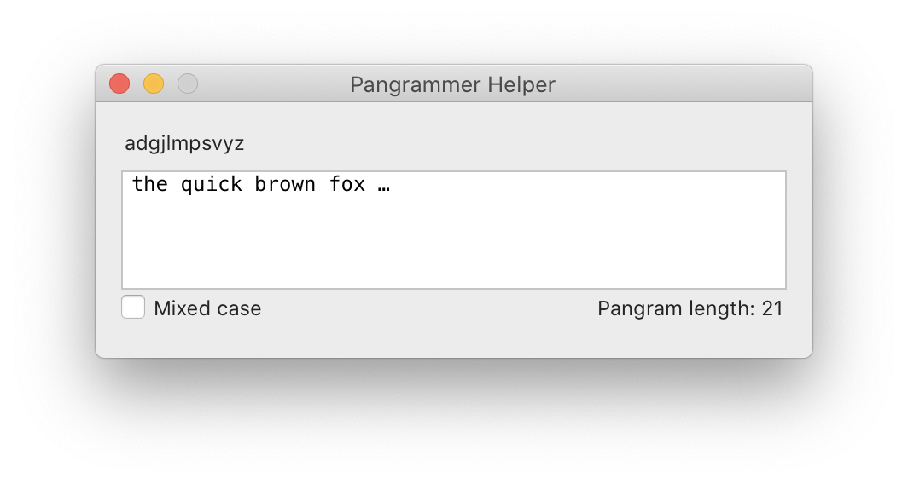

# Pangrammer Helper

Mark Simonson’s Pangrammer Helper as a Robofont Extension!  
Offically sanctioned by Mark, slightly updated for Python 3, but mostly an opportunity to host this code on GitHub.

## History
- Pangrammer Helper 1.0 and 2.0 (2003/2008) - Flash applications:  
https://www.marksimonson.com/notebook/view/pangrammer-helper
https://www.marksimonson.com/notebook/view/pangrammer-helper-20

- Pangrammer Helper, Robofont Style v1.2 (2012):  
https://www.marksimonson.com/notebook/view/pangrammer-helper-robofont-style

